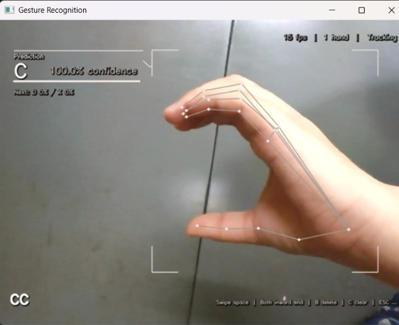

# 🖐️ Real-Time Hand Gesture Recognition System

## Overview

This project implements a real-time hand gesture recognition system that captures live video input, detects hand landmarks, and classifies gestures using a machine learning model. The system converts recognized gestures into meaningful text sequences, enabling intuitive human-computer interaction.

---

## Problem Statement

Hand gesture recognition plays a key role in enabling communication for individuals who rely on sign language.  
This project focuses on building a real-time system that detects and interprets hand gestures from live video input and converts them into meaningful text, supporting more accessible and natural human-computer interaction.

---

## Features

* Real-time hand landmark detection using MediaPipe
* Gesture classification using a trained MLP classifier
* Dual-hand tracking and recognition
* Dynamic text generation from gesture sequences
* Custom data collection and training pipeline

---

## Project Structure

```text
gesture-recognition/
├── scripts/
│   ├── data.py              # Collect training data via webcam
│   ├── train.py             # Train the gesture classifier
│   ├── model.py             # Real-time gesture recognition
│   ├── hand_tracking.py     # MediaPipe landmark detection
│   ├── camera.py            # Camera setup and preprocessing
│   └── ui.py                # UI rendering and overlays
├── data/
│   └── gesture_data.csv     # Collected dataset
└── docs/
    ├── demo.png       # Demo preview
    └── hand_landmarks.png   # 21-point landmark diagram
```

---

## How It Works

### 1. Hand Landmark Detection

MediaPipe detects **21 keypoints per hand**, each with (x, y, z) coordinates.
With two hands, the system generates a **126-dimensional feature vector** per frame.

---

### 2. Data Collection

* Captures hand landmark data via webcam
* Saves labeled samples to CSV
* Each sample contains normalized landmark coordinates

---

### 3. Model Training

* Model: Multi-Layer Perceptron (MLPClassifier)
* Architecture: **256 → 128 → 64 (ReLU activations)**
* Preprocessing:

  * Feature scaling (StandardScaler)
  * Label encoding
* Data augmentation:

  * Gaussian noise
  * Random scaling (±10%)
  * Small rotations (±10°)
* Evaluation:

  * Train-test split
  * 5-fold cross-validation

---

### 4. Real-Time Recognition

* Loads trained model and runs inference on live video
* Uses confidence thresholding (≥70%)
* Converts gesture predictions into text
* Supports gesture-based controls (word break, delete, clear)

---

## Results

* Achieves reliable gesture classification accuracy on test data
* Low-latency real-time inference using asynchronous processing
* Stable performance for dual-hand gesture recognition

---

## Tech Stack

| Component        | Technology                   |
| ---------------- | ---------------------------- |
| Hand tracking    | MediaPipe                    |
| Image processing | OpenCV                       |
| ML model         | scikit-learn (MLPClassifier) |
| Data processing  | NumPy, pandas                |
| UI rendering     | OpenCV                       |

---

## Setup

### Install dependencies

```bash
pip install opencv-python mediapipe scikit-learn pandas numpy
```

---

### Run the pipeline

**Step 1 — Collect data**

```bash
python scripts/data.py
```

**Step 2 — Train model**

```bash
python scripts/train.py
```

**Step 3 — Run recognition**

```bash
python scripts/model.py
```

---

## Key Design Highlights

* Real-time processing using asynchronous hand tracking
* Feature engineering based on spatial hand landmarks
* Modular pipeline (data → training → inference)
* Robust handling of dual-hand input

---

## Demo



---

## Author

<div align="center">

[](https://github.com/23f2003639)

</div>
